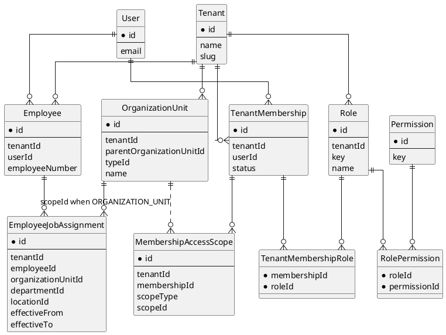
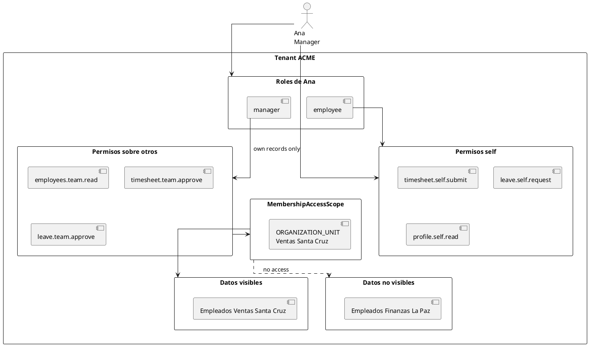
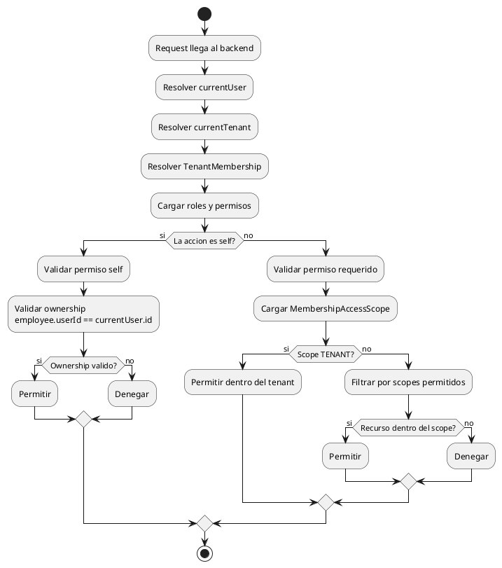
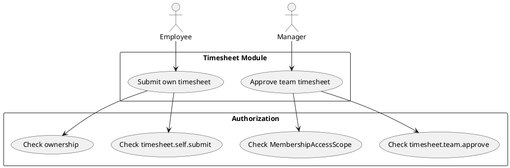
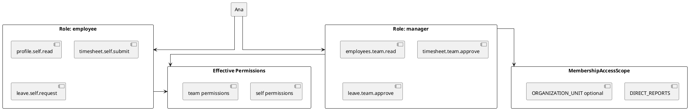

# Roles, Membership Access Scope And Employee Scenarios

Fecha: 2026-05-17

## Objetivo

Explicar como deben convivir:

```txt
User
Employee
TenantMembership
Role
Permission
OrganizationUnit
EmployeeJobAssignment
MembershipAccessScope
```

La meta es evitar confusiones comunes:

```txt
- un manager tambien es employee;
- un employee normal debe ver sus propias vistas;
- un manager debe ver/aprobar datos de otros solo dentro de su alcance;
- OrganizationUnit no debe reemplazar roles;
- Role no debe duplicarse por sucursal/unidad;
- MembershipAccessScope no debe usarse para todo, especialmente no para self.
```

## Resumen Ejecutivo

Separar cuatro preguntas:

```txt
Quien es?
  User / Employee

Donde trabaja?
  EmployeeJobAssignment.organizationUnitId

Que puede hacer?
  Role + Permission

Donde o sobre quienes puede hacerlo?
  MembershipAccessScope
```

Regla central:

```txt
Role define acciones.
MembershipAccessScope limita alcance sobre otros.
EmployeeJobAssignment define pertenencia laboral.
```

No conviene crear roles como:

```txt
manager_santa_cruz
manager_la_paz
hr_admin_peru
```

Conviene:

```txt
Role: manager
Scope: OrganizationUnit Santa Cruz
```

## Modelo Mental

Un `User` es la cuenta que inicia sesion.

Un `Employee` es la persona como empleado dentro de un tenant.

Un `TenantMembership` conecta al user con un tenant y sus roles.

Un `EmployeeJobAssignment` indica donde trabaja ese empleado actualmente o
historicamente.

Un `MembershipAccessScope` indica que parte del tenant puede administrar o ver
ese usuario cuando ejecuta acciones sobre otros.

## Diagrama De Entidades



## Employee Normal

Un employee normal necesita vistas propias:

```txt
Mi perfil
Mis documentos
Mi timesheet
Mis vacaciones
Mis solicitudes
```

Para eso no necesita `MembershipAccessScope`.

Necesita permisos tipo `self`:

```txt
profile.self.read
profile.self.update
timesheet.self.submit
leave.self.request
documents.self.read
```

El backend debe validar ownership:

```txt
employee.userId = currentUser.id
```

Esto responde:

```txt
El usuario esta accediendo a su propia informacion?
```

No responde:

```txt
A que OrganizationUnit tiene acceso administrativo?
```

## Manager

Un manager tambien es employee.

Por eso puede tener roles acumulables:

```txt
employee
manager
```

El role `employee` le da sus vistas propias.

El role `manager` agrega acciones sobre otros:

```txt
employees.team.read
timesheet.team.approve
leave.team.approve
performance.team.review
```

Para esas acciones sobre otros, si se usa `MembershipAccessScope`.

Ejemplo:

```txt
User: ana@company.com
Employee: Ana Rojas
Roles:
  employee
  manager
AccessScope:
  ORGANIZATION_UNIT = Ventas Santa Cruz
```

Resultado:

```txt
Ana puede llenar su propio timesheet.
Ana puede solicitar sus vacaciones.
Ana puede ver/aprobar timesheets de empleados de Ventas Santa Cruz.
Ana no puede ver/aprobar empleados de Finanzas La Paz.
```

## Diagrama De Manager



## HR Staff O HR Admin Limitado

Un usuario de HR puede trabajar en una unidad, pero administrar otra.

Ejemplo:

```txt
Maria trabaja en HR Central.
Maria administra empleados de Santa Cruz y La Paz.
```

Su pertenencia laboral:

```txt
EmployeeJobAssignment.organizationUnitId = HR Central
```

Sus scopes de acceso:

```txt
MembershipAccessScope:
  ORGANIZATION_UNIT = Santa Cruz
  ORGANIZATION_UNIT = La Paz
```

Por eso no se debe asumir que:

```txt
unidad donde trabaja = unidad que puede administrar
```

Son conceptos distintos.

## Owner

El owner debe ser tenant-wide.

```txt
Role:
  owner

AccessScope:
  TENANT
```

Reglas:

```txt
- owner no debe estar limitado a una OrganizationUnit;
- owner no debe ser archivable;
- owner no debe ser deshabilitable;
- siempre debe existir al menos un owner efectivo por tenant.
```

## Tipos De Scope

Conceptual:

```prisma
enum AccessScopeType {
  TENANT
  ORGANIZATION_UNIT
  DEPARTMENT
  LOCATION
  DIRECT_REPORTS
  SELF
}
```

Recomendacion:

```txt
TENANT:
  acceso a todo el tenant.

ORGANIZATION_UNIT:
  acceso a empleados/datos dentro de una unidad organizacional.

DEPARTMENT:
  acceso a un area/departamento especifico.

LOCATION:
  acceso por sitio fisico, si el caso de negocio lo requiere.

DIRECT_REPORTS:
  acceso solo a reportes directos o linea jerarquica del manager.

SELF:
  normalmente no hace falta guardarlo; se puede resolver por ownership.
```

Para v1, se puede implementar menos:

```txt
TENANT
ORGANIZATION_UNIT
DIRECT_REPORTS
```

Y dejar `DEPARTMENT`, `LOCATION` y `SELF` para cuando haya casos reales.

## MembershipAccessScope No Reemplaza Ownership

Acciones self:

```txt
timesheet.self.submit
leave.self.request
profile.self.read
```

Se validan con:

```txt
employee.userId = currentUser.id
```

Acciones sobre otros:

```txt
employees.team.read
timesheet.team.approve
leave.team.approve
employees.update
```

Se validan con:

```txt
Permission + MembershipAccessScope
```

Regla:

```txt
Si la accion opera sobre mi propio registro, usar ownership.
Si la accion opera sobre otros, usar access scope.
```

## Flujo De Autorizacion



## Ejemplo: Timesheet

### Employee Envia Su Timesheet

```txt
Permission:
  timesheet.self.submit

Validacion:
  timesheet.employee.userId = currentUser.id

MembershipAccessScope:
  no requerido
```

### Manager Aprueba Timesheet

```txt
Permission:
  timesheet.team.approve

Validacion:
  manager tiene scope sobre el empleado objetivo

MembershipAccessScope:
  ORGANIZATION_UNIT, DIRECT_REPORTS o TENANT
```

## Diagrama De Timesheet



## Ejemplo: Vacaciones

### Employee Solicita Vacaciones

```txt
Permission:
  leave.self.request

Validacion:
  leaveRequest.employee.userId = currentUser.id

MembershipAccessScope:
  no requerido
```

### Manager Aprueba Vacaciones

```txt
Permission:
  leave.team.approve

Validacion:
  empleado objetivo esta dentro de los scopes del manager

MembershipAccessScope:
  ORGANIZATION_UNIT o DIRECT_REPORTS
```

### HR Admin Aprueba Cualquier Solicitud

```txt
Permission:
  leave.requests.manage

Validacion:
  si scope TENANT, todo el tenant
  si scope ORGANIZATION_UNIT, solo esas unidades
```

## Diagrama De Roles Acumulables



## Riesgos Comunes

### Riesgo 1: Usar OrganizationUnit Del Empleado Como Scope Automatico

No siempre es correcto.

Ejemplo:

```txt
Maria trabaja en HR Central.
Maria administra Santa Cruz y La Paz.
```

Si se usa su `EmployeeJobAssignment.organizationUnitId` como scope automatico,
Maria solo podria administrar HR Central, que no es lo que se quiere.

### Riesgo 2: Guardar Scope Para Self

No hace falta guardar:

```txt
SELF -> employeeId
```

para cada employee normal si el backend puede resolver:

```txt
employee.userId = currentUser.id
```

Guardar SELF puede ser util en casos avanzados, pero para v1 agrega ruido.

### Riesgo 3: Crear Roles Por Unidad

No recomendado:

```txt
manager_santa_cruz
manager_la_paz
manager_lima
```

Escala mal y mezcla permisos con alcance.

Recomendado:

```txt
Role: manager
Scope: Santa Cruz
```

### Riesgo 4: Crear MembershipAccessScope Pero No Aplicarlo

Si existe la tabla pero los endpoints no filtran por scope, no hay seguridad
real.

Ejemplo peligroso:

```txt
Maria tiene scope Santa Cruz.
GET /employees devuelve todo el tenant.
```

Por eso conviene implementar scopes junto con filtros reales en endpoints
piloto.

## Implementacion Recomendada Por Fases

### Fase 1: OrganizationUnit Y Pertenencia Laboral

```txt
1. Crear OrganizationUnitType.
2. Crear OrganizationUnit.
3. Agregar organizationUnitId a EmployeeJobAssignment.
4. Mantener Location como sitio fisico.
5. Crear UI para estructura organizacional.
```

Esto permite:

```txt
- saber donde trabaja cada empleado;
- crear jerarquia de compania;
- preparar reportes;
- preparar configuraciones por unidad.
```

### Fase 2: MembershipAccessScope Para Employees

```txt
1. Crear MembershipAccessScope.
2. Agregar scopes a CurrentUser/TenantContext.
3. Aplicar filtros en endpoints de employees.
4. Cubrir GET /employees, GET /employees/:id, import/export.
5. Agregar tests de aislamiento por OrganizationUnit.
```

Esto permite:

```txt
- HR limitado por unidad;
- managers limitados por direct reports o unidad;
- owner/admin tenant-wide.
```

### Fase 3: Scopes En Otros Modulos

Aplicar progresivamente:

```txt
timesheet
leave requests
documents
performance reviews
compensation
```

No aplicar todo en una sola entrega.

## Reglas Recomendadas

```txt
1. Todo employee debe pertenecer al tenant.
2. Todo employee activo deberia tener una asignacion laboral actual.
3. La OrganizationUnit del employee vive en EmployeeJobAssignment.
4. Un manager puede tener roles employee + manager.
5. El role employee da permisos self.
6. El role manager da permisos sobre otros.
7. Acciones self usan ownership, no MembershipAccessScope.
8. Acciones sobre otros usan Permission + MembershipAccessScope.
9. Owner debe tener scope TENANT.
10. No duplicar roles por OrganizationUnit.
```

## Decision Recomendada

El modelo mas claro es:

```txt
Employee normal:
  Role employee
  Permisos self
  Sin MembershipAccessScope requerido para sus propias vistas

Manager:
  Role employee
  Role manager
  Permisos self + team
  MembershipAccessScope DIRECT_REPORTS u ORGANIZATION_UNIT

HR Staff:
  Role hr_staff
  MembershipAccessScope ORGANIZATION_UNIT o TENANT

Owner:
  Role owner
  MembershipAccessScope TENANT
```

Esto evita complicarse de mas porque cada pieza tiene una responsabilidad:

```txt
EmployeeJobAssignment:
  donde trabaja la persona.

Role:
  que acciones puede ejecutar.

MembershipAccessScope:
  sobre que parte del tenant puede ejecutar acciones sobre otros.

Ownership:
  si el recurso es suyo, puede operar con permisos self.
```
